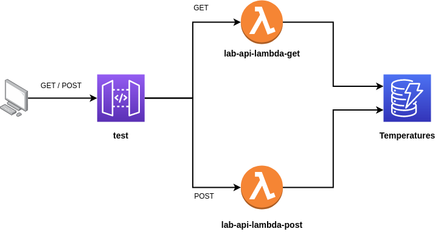

# Terraform sample serveless API

A terraform to build a Serverless API on AWS with API Gateway + Lambda python function + DynamoDB. \
This project uses the [Serverless API with AWS and Python Tutorial](https://medium.com/accenture-the-dock/serverless-api-with-aws-and-python-tutorial-3dff032628a7)



# S3 backend

In order to save the terraform state on S3 create a file _backend.tf_

```json
terraform {
  backend "s3" {
    bucket = "mybucket"
    key    = "path/to/my/key"
    region = "us-east-1"
  }
}
```

# Test the API 

```bash
curl -s -X POST 'api_url' \
--header 'Content-Type: application/json' \
--data-raw '{
    "deviceId":"device-2",
    "temperature":"32"
}
'

curl -s -X POST 'api_url' \
--header 'Content-Type: application/json' \
--data-raw '{
    "deviceId":"device-2",
    "temperature":"a"
}
'
```

```bash
curl -s 'api_url'
```

where _api\_url_ is the API url ( see terraform apply output )
